# Reservation System for Places and Classes in Univeristies and Departments

A web application that makes the reservation of classes and places easier in anywhere

## Introduction

Read the instructions below to know the details of the project

### Prerequisites

The following technologies are needed for the technologies this project:

1. Node.js
2. Python 3.5+
3. Django Web Framework
4. React.js + Material UI

### Built With

- [Django Web Framework](https://www.djangoproject.com/) - Back End Framework
- [React.js](https://reactjs.org/) - Front End Library
- [Material-UI](https://material-ui.com/) - UI Framework

### Getting Started

Making Virtual Environment

```bash
pip install virtualenv
virtualenv -p python3 venv
```

Activating Vitrual Envrionment

```bash
source venv/bin/activate
```

Installing Packages

```bash
pip install -r requirements.txt
```

Migrating the database

```bash
python manage.py migrate
```

Run The Test Server

```bash
python manage.py runserver
```

## Authors and Credit

- **[Mohammad Mahdi Mohajer](https://github.com/mmohajer9)**

## License

## Screenshots

<p align="center">
  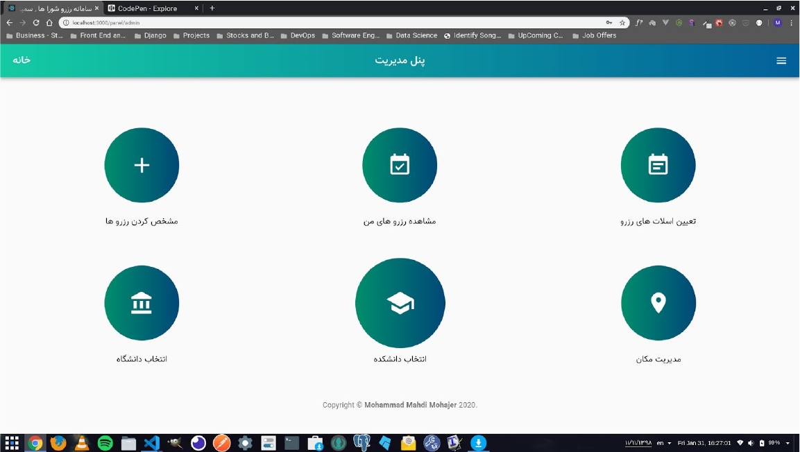
  
  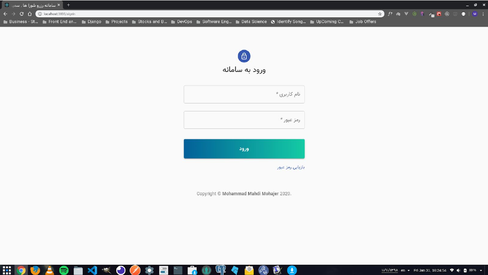
  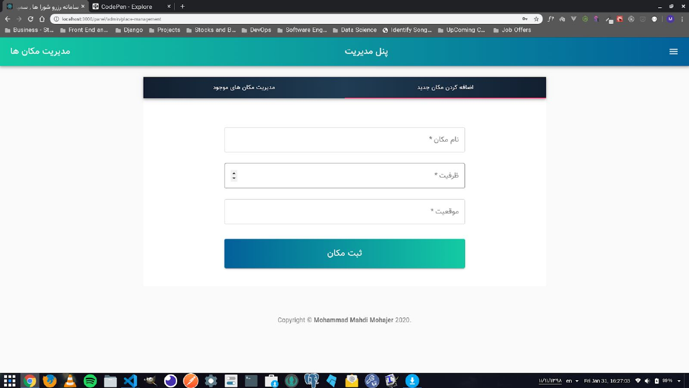
  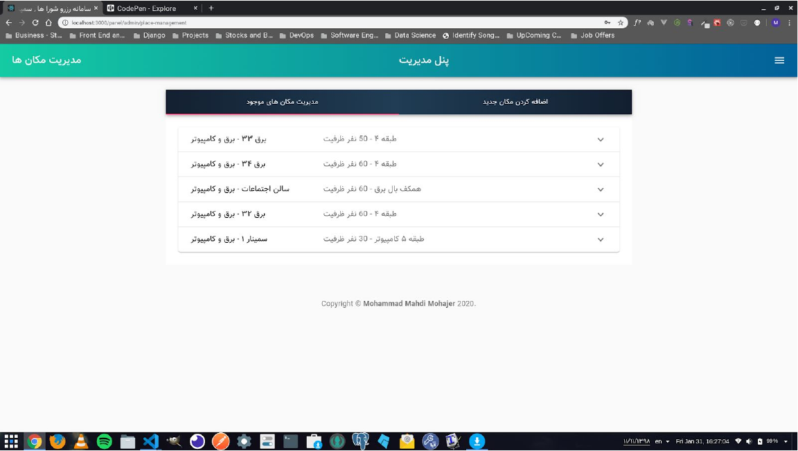
  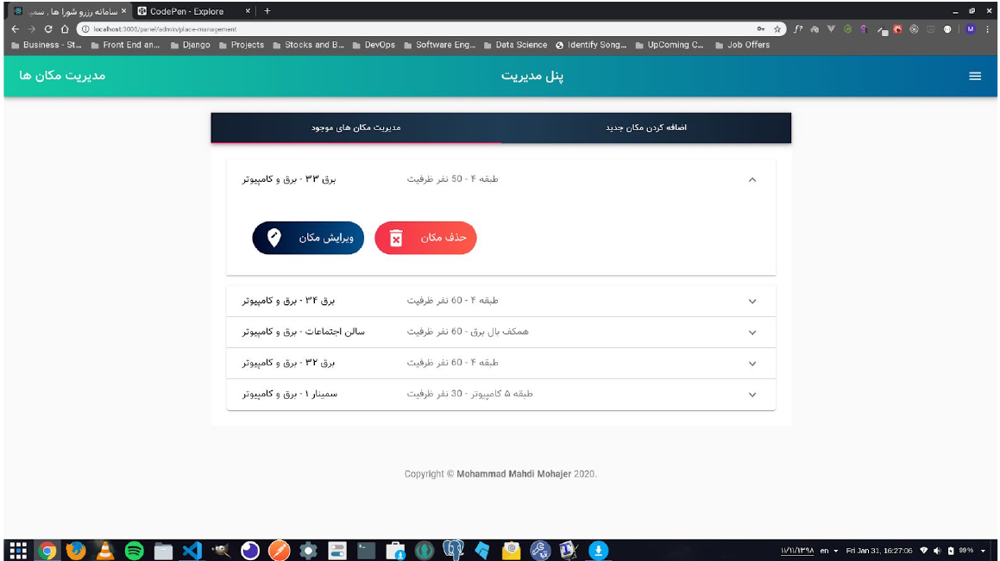
</p>

<p align="center">
  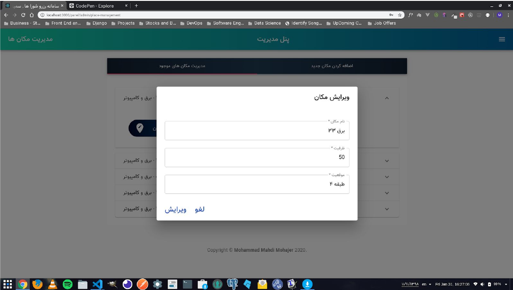
  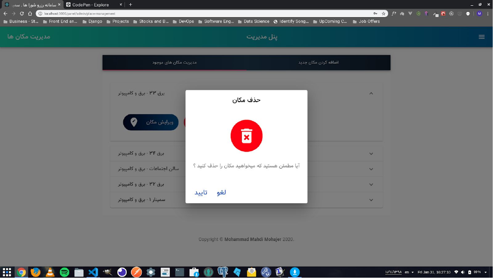
  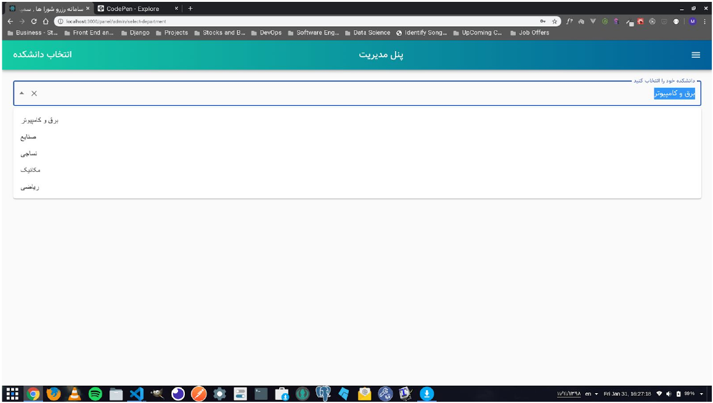
  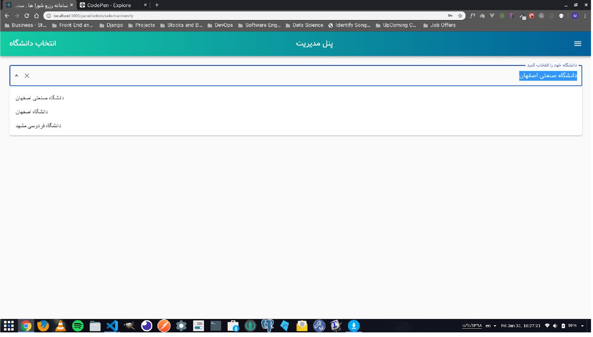
  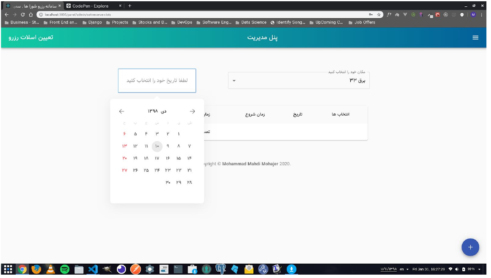
  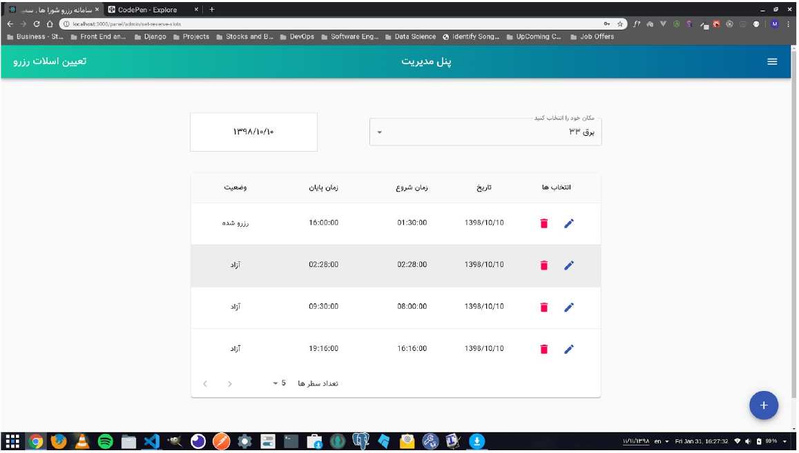
</p>

This project is licensed under the MIT License - see the [LICENSE](./LICENSE) file for details
